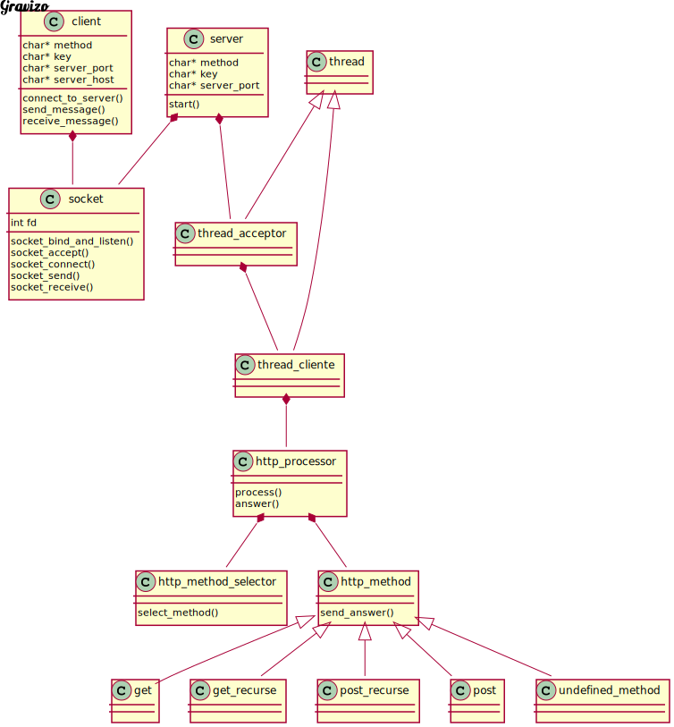

# TP3---Pages
# Alumna: Azul Zaietz
# Padrón: 102214

En este trabajo se implementa una aplicación servidor que atiende petitorios HTTP. El servidor puede acceder y dar de alta a recursos del mismo. Devuelve al cliente una respuesta también en
formato HTTP.

El siguiente informe detalla información relevante del proceso de desarrollo del programa: su esqueleto, diagrama de clases y soluciones a algunos problemas presentados.

# DISEÑO

Antes de implementar la solución, se empezó por diseñarla, planteando las diferentes estructuras del programa y cómo iban a relacionarse entre sí. 
El diseño se pensó usando como base la programación orientada a objetos.

En un principio se plantearon los siguientes:

- SOCKET: un TDA socket con los métodos necesarios para poder efectuar la comunicación entre cliente y servidor: abrir el socket, esperar a una conexión, aceptarla, enviar y recibir mensajes a través del mismo, y finalmente cerrar el socket correctamente.

- SERVIDOR: TDA que use a los mencionados anteriormente para cumplir su función: abrir un socket, esperar a recibir un peritorio y enviar la respuesta correspondiente.

- CLIENTE: TDA que utiliza al socket para enviar un peritorio HTTP al servidor y esperar su respuesta.

- HTTP PROCESSOR: encargado de procesar el peritorio HTTP.

- HTTP METHOD: encargado de devolver la respuesta correspondiente al método recibido (procesado anteriormente por el HTTP PROCESSOR). Clase padre de la que van a heredar cada uno de los métodos a implementar para aplicar una solución polimórfica:
    - Get
    - Get con recurso
    - Post
    - Post con recurso
    - Instrucciones no soportadas

- BASE DE DATOS: para almacenar y acceder a los recursos de los peritorios HTTP.

- HILO: TDA generico con los metodos para hacer funcionar un hilo de ejecución.

- HILO ACEPTADOR: TDA que hereda del hilo generico con el metodo "run()" correspondiente (sobreescrito) para procesar muchos clientes.

- HILO CLIENTE: TDA que hereda del hilo generico con el metodo "run()" correspondiente (sobreescrito) para enviar peritorios http y recibir la respuesta del servidor.

# IMPLEMENTACIÓN

Durante la implementación se agregó un nuevo TDA para abstraer el código de selección del método correspondiente del processor. Así el processor sólo se ocupa concretamente de procesar el texto recibido. El "METHOD SELECTOR" se ocupa de crear la instancia correspondiente según el método recibido (procesado anteriormente).

# Diagrama de clases representativo de la solución final:

